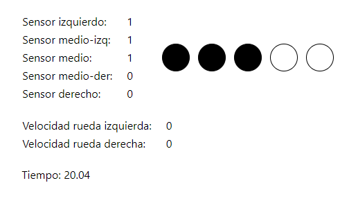

# Pasos para ejecutar el proyecto

1. Abrir una terminal de Windows o de Visual Studio Code

2. Clonar el repositorio con `git clone https://github.com/OscarRojasG/Robotica.git`

3. Instalar las dependencias con `npm install`

4. Abrir la interfaz con `npm start`
    * En caso de errores, intente ejecutar el comando `npm audit fix` o borrar la carpeta `node_modules` y reinstalar las dependencias.

5. Conectar el Arduino y cargar el script `codigo.ino` dentro de la carpeta `codigo`

6. Abrir el archivo `codigo.py` y cambiar `COM3` por el puerto serial correspondiente.

7. Ejecutar el archivo `codigo.py`

8. Listo! Ya puede visualizar en la interfaz cómo cambian las variables del robot en tiempo real.

